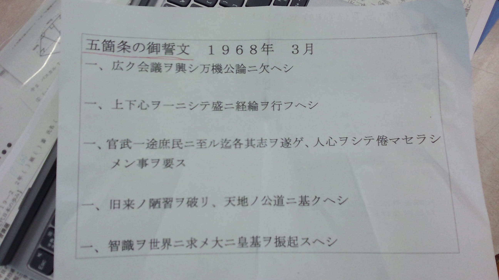
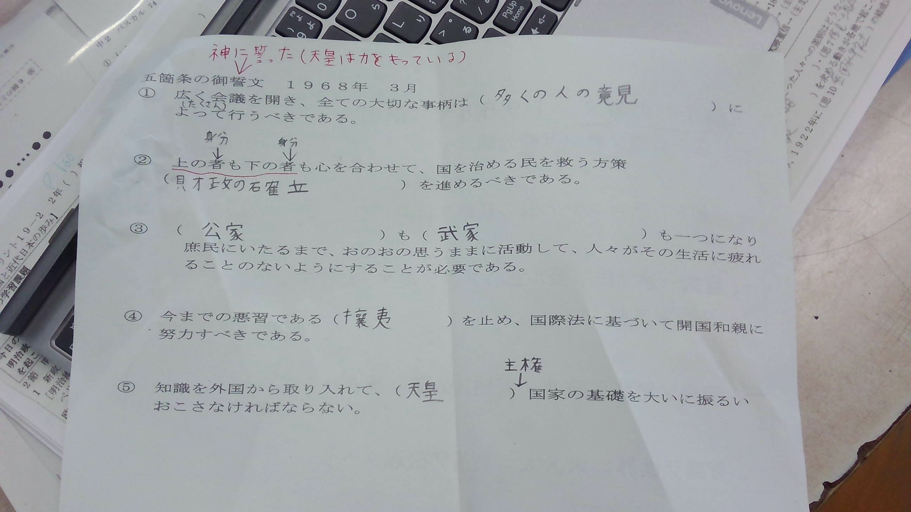
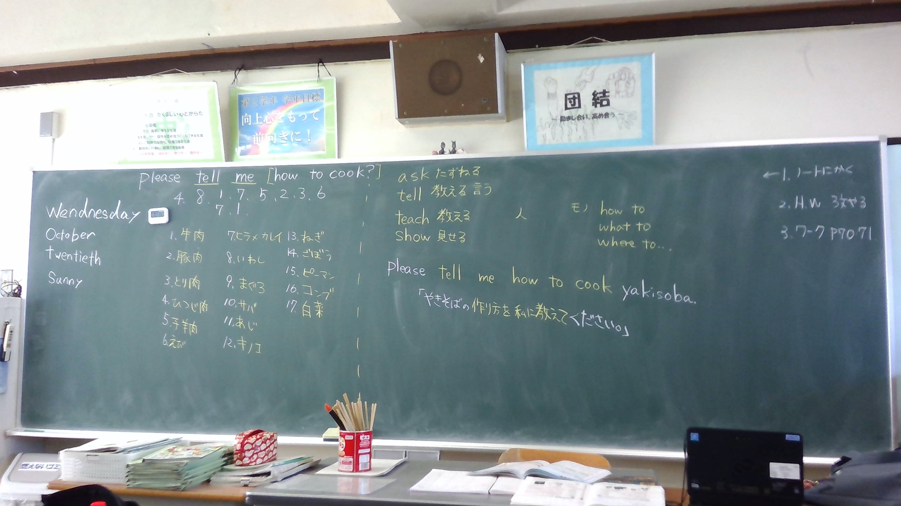
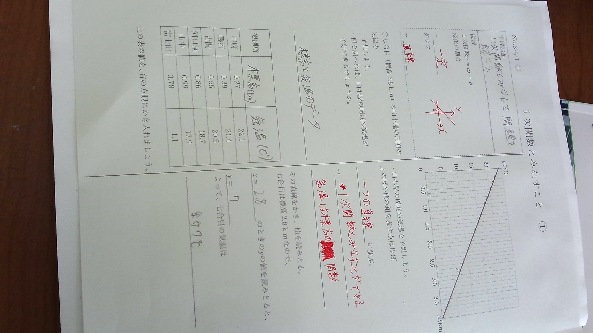

<head>
  
<meta chareset="utf-8">
<title>玲音の遊び場</title>
<meta name="descripton" content="htmlの本を土橋君が持っているのでjavespcript">
<head>
<body>
  

    

  
  
  
  
   
  
  
  <table>
    <tr>
      <th>小麦粉</th>
      <td>大さじ１杯</td>
      <th>ベーキングパウダー</th>
      <td>小さじ1杯半</td>
      </tr> 
  </table>
  </body>
